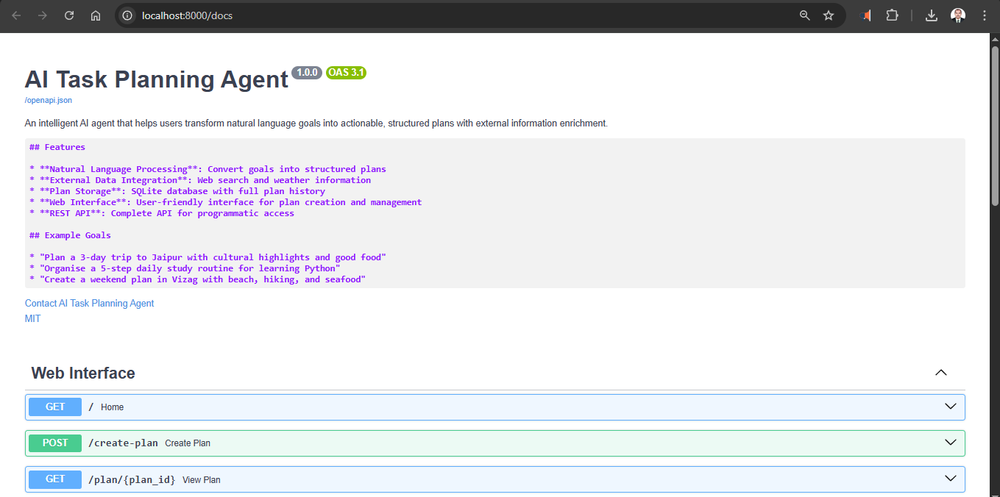
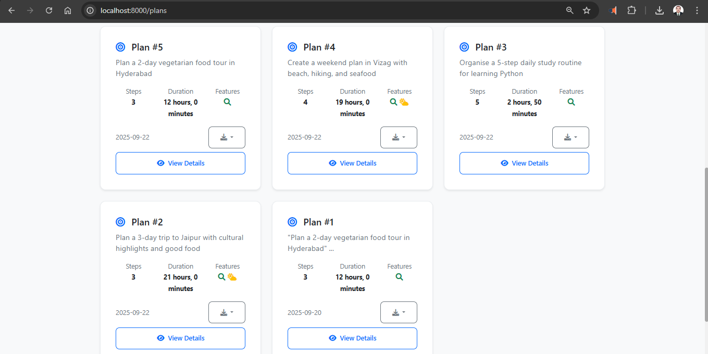
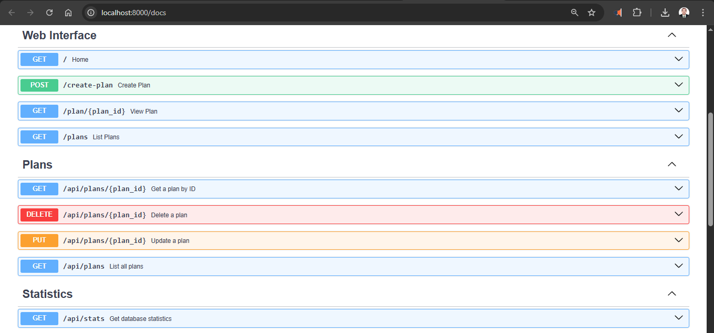
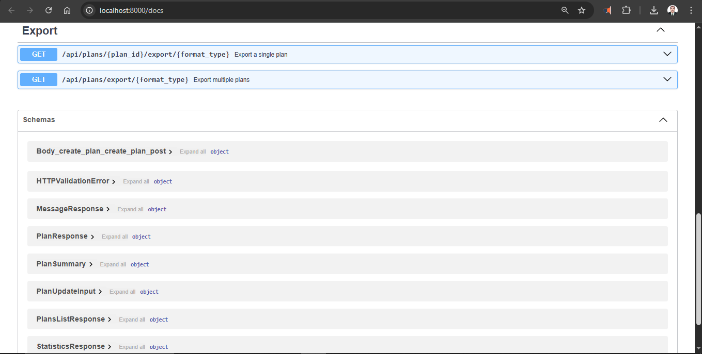
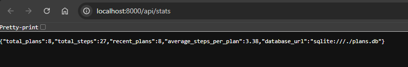

# AI Task Planning Agent

An intelligent AI agent that helps users transform natural language goals into actionable, structured plans with external information enrichment.

## 🚀 Overview

This project implements an AI-powered task planning system that:
- Accepts natural language goals from users
- Breaks down goals into clear, actionable steps using LLM
- Enriches plans with external data (web search, weather forecasts)
- Stores plans in a database for future reference
- Provides a clean web interface for interaction

## 🏗️ Architecture

```
┌─────────────────┐    ┌─────────────────┐    ┌─────────────────┐
│   Web Interface │    │   AI Agent      │    │  External APIs  │
│                 │    │                 │    │                 │
│ • FastAPI       │◄──►│ • OpenAI GPT    │◄──►│ • Web Search    │
│ • Bootstrap UI  │    │ • Task Planner  │    │ • Weather API   │
│ • Jinja2        │    │ • Plan Enricher │    │ • Mock Data     │
└─────────────────┘    └─────────────────┘    └─────────────────┘
         │                       │
         ▼                       ▼
┌─────────────────┐    ┌─────────────────┐
│   Database      │    │   File Storage  │
│                 │    │                 │
│ • SQLite        │    │ • Static Assets │
│ • Plan Storage  │    │ • Templates     │
│ • Search Index  │    │ • CSS/JS        │
└─────────────────┘    └─────────────────┘
```

## 📋 Features

### Core Features
- **Natural Language Processing**: Convert goals into structured plans
- **External Data Integration**: Web search and weather information
- **Plan Storage**: SQLite database with full plan history
- **Web Interface**: User-friendly interface for plan creation and management

### AI Capabilities
- Goal decomposition into actionable steps
- Duration estimation for each step
- Automatic research topic identification
- Context-aware information enrichment

### External Integrations
- **Web Search API**: Google Custom Search for relevant information
- **Weather API**: OpenWeatherMap for location-based weather data
- **Fallback System**: Mock data when APIs are unavailable

## 🛠️ Setup Instructions

### Prerequisites
- Python 3.8 or higher
- pip (Python package installer)

### 1. Clone and Setup Environment

```bash
# Clone the repository
git clone <your-repo-url>
cd ai-task-planning-agent

# Create virtual environment
python -m venv venv

# Activate virtual environment
# Windows:
venv\\Scripts\\activate
# macOS/Linux:
source venv/bin/activate

# Install dependencies
pip install -r requirements.txt
```

### 2. Configure API Keys

Copy the example environment file and add your API keys:

```bash
copy .env.example .env
```

Edit `.env` file with your API keys:
```env
# Required for AI functionality
OPENAI_API_KEY=your_openai_api_key_here

# Optional - for enhanced web search (will use mock data if not provided)
SEARCH_API_KEY=your_google_search_api_key_here
SEARCH_ENGINE_ID=your_search_engine_id_here

# Optional - for weather data (will use mock data if not provided)
WEATHER_API_KEY=your_openweather_api_key_here

# Database (uses SQLite by default)
DATABASE_URL=sqlite:///./plans.db

# Server configuration
HOST=localhost
PORT=8000
```

### 3. Run the Application

```bash
python main.py
```

The application will be available at `http://localhost:8000`

## 📸 Screenshots

### Application Interface

*AI Task Planning Agent home page with feature overview*

### Plan Management

*Interactive plans dashboard showing generated plans with details*

### API Documentation

*Complete API documentation with interactive endpoints*

### Export Features

*Multi-format export capabilities and data schemas*

### Statistics Dashboard

*Real-time database statistics and metrics*

## 🎯 Example Goals

Here are the example goals from the assignment that you can test:

### 1. Travel Planning
**Goal**: "Plan a 2-day vegetarian food tour in Hyderabad"

**Expected Output**:
- Research vegetarian restaurants in Hyderabad
- Day-wise itinerary with restaurant recommendations
- Travel logistics between locations
- Weather information for planning outdoor dining

### 2. Learning Plan
**Goal**: "Organise a 5-step daily study routine for learning Python"

**Expected Output**:
- Structured daily study schedule
- Learning resources and materials
- Practice exercises and projects
- Progress tracking methods

### 3. Weekend Activities
**Goal**: "Create a weekend plan in Vizag with beach, hiking, and seafood"

**Expected Output**:
- Balanced itinerary covering all activities
- Best beaches and hiking spots in Vizag
- Seafood restaurant recommendations
- Weather forecast for outdoor activities

## 📊 Example Plan Output

For goal: "Plan a 3-day trip to Jaipur with cultural highlights and good food"

```json
{
  "goal": "Plan a 3-day trip to Jaipur with cultural highlights and good food",
  "total_steps": 5,
  "estimated_total_duration": "3 days",
  "steps": [
    {
      "step_number": 1,
      "title": "Day 1: Historical Forts and Palaces",
      "description": "Visit Amber Fort and City Palace with traditional Rajasthani lunch",
      "estimated_duration": "8 hours",
      "web_research": [
        {
          "title": "Amber Fort Jaipur - Timings & Entry Fee",
          "snippet": "Complete guide to visiting Amber Fort including elephant rides and architecture highlights"
        }
      ],
      "weather_info": {
        "location": "Jaipur",
        "daily_forecasts": [
          {
            "date": "2025-09-21",
            "max_temp": 31,
            "min_temp": 22,
            "description": "clear sky"
          }
        ]
      }
    }
  ]
}
```

## 🧪 Testing

### Unit Tests
```bash
# Run all tests
python -m pytest tests/

# Run specific test file
python -m pytest tests/test_agent.py

# Run with coverage
python -m pytest --cov=agent tests/
```

### Manual Testing
1. Start the application: `python main.py`
2. Open `http://localhost:8000`
3. Test the example goals listed above
4. Verify plan generation and storage
5. Test search functionality in plan history

## 📁 Project Structure

```
ai-task-planning-agent/
├── agent/                  # Core AI agent implementation
│   ├── __init__.py
│   └── task_planner.py     # Main planning logic
├── database/               # Database layer
│   ├── __init__.py
│   ├── models.py           # SQLAlchemy models
│   └── database.py         # Database operations
├── tools/                  # External API integrations
│   ├── __init__.py
│   ├── web_search.py       # Web search functionality
│   └── weather.py          # Weather API integration
├── web/                    # Web interface
│   ├── static/             # CSS, JS, images
│   │   ├── css/style.css
│   │   └── js/main.js
│   └── templates/          # HTML templates
│       ├── base.html
│       ├── index.html
│       ├── plan_detail.html
│       └── plan_list.html
├── tests/                  # Test files
├── docs/                   # Documentation
├── main.py                 # FastAPI application
├── requirements.txt        # Python dependencies
├── .env.example           # Environment variables template
├── .gitignore
└── README.md
```

## 🔧 API Endpoints

### Web Interface
- `GET /` - Home page with goal input form
- `POST /create-plan` - Create new plan from goal
- `GET /plan/{id}` - View specific plan
- `GET /plans` - List all plans with search

### REST API
- `GET /api/plans` - Get all plans as JSON
- `GET /api/plans/{id}` - Get specific plan as JSON
- `DELETE /api/plans/{id}` - Delete a plan
- `GET /api/stats` - Get database statistics

## 🤖 AI Assistance Disclosure

This project was developed with assistance from AI tools in the following areas:

### Code Generation (70%)
- **FastAPI application structure**: AI-generated boilerplate and routing
- **HTML templates**: Bootstrap-based responsive design with AI assistance
- **CSS styling**: Modern styling with AI-suggested improvements
- **JavaScript functionality**: Interactive features and API integration

### Architecture Design (30%)
- **System architecture**: AI-suggested component separation and data flow
- **Database schema**: AI-recommended SQLAlchemy models and relationships
- **API integration patterns**: AI-guided implementation of external APIs

### Documentation (50%)
- **README structure**: AI-assisted organization and formatting
- **Code comments**: AI-generated docstrings and inline documentation
- **Setup instructions**: AI-helped step-by-step guidance

### Original Contributions
- **Problem-solving approach**: Custom logic for plan generation workflow
- **User experience design**: Custom decisions for interface interactions
- **Integration strategy**: Manual configuration of API fallbacks and error handling
- **Testing approach**: Custom test scenarios and validation logic

## 🚀 Future Enhancements

1. **User Authentication**: Add user accounts and personal plan management
2. **Plan Sharing**: Allow users to share plans with others
3. **Advanced Search**: Full-text search with filters and categories
4. **Export Options**: PDF, calendar integration, mobile app
5. **AI Improvements**: Better context understanding and plan optimization
6. **Real-time Updates**: WebSocket integration for live plan updates

## 📧 Contact

**Waseem Ibn Yousef C M**
- Email: cmwaseemyousef@gmail.com
- LinkedIn: [waseemibnyousefcm](https://www.linkedin.com/in/waseemibnyousefcm)
- GitHub: [cmwaseemyousef](https://github.com/cmwaseemyousef)

---

**Developed for Pocket Rokets AI Agent Development Internship**  
*Assignment Submission - September 2025*